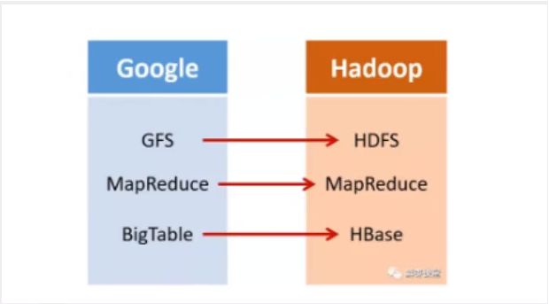
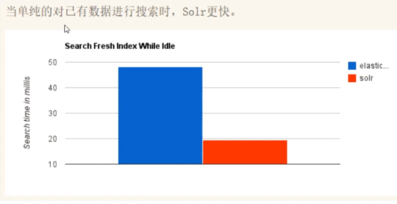
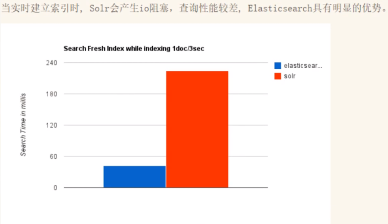
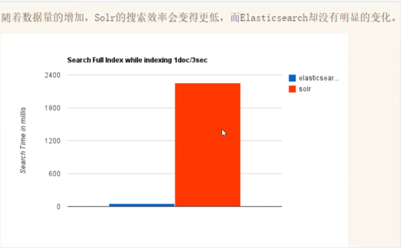

# 历史

* <https://awslzhang.top/2020/10/18/%E7%8B%82%E7%A5%9E%E8%AF%B4Elasticsearch-7-x%E7%AC%94%E8%AE%B0%EF%BC%88%E7%BA%AF%E6%89%8B%E6%95%B2%EF%BC%89/>

## Lucene诞生

1998年9月4号,google公司在美国硅谷成立.正如大家所知,它是一家搜索引擎起家的公司

无独有偶,一位名叫DougCutting的美国工程师,也迷上了搜索引擎.他做了一个用于文本搜索的函数库(姑且理解为软件的功能组件),命名为Lucene.

* Lucene是一套信息检索工具包！jar包！不包含搜索引擎系统
* 包含索引结构、读写多音的工具、排序、搜索规则、工具类

## Elasticsearch简介

**Elasticsearch是基于Lucene做了一些封装和增强**

Elasticsearch,简称为ES,es是一个**开源**的**扩展**的**分布式全文检索引擎**,他可以近乎实时的存储,检索数据;本身扩展性很好,可以扩展到上百台服务器,处理PB级别(大数据时代)的数据.es也使用Java并发使用Lucene作为其核心来实现所有索引和搜索的功能,但是它的目的是通过简单的**RESTful API**来隐藏Lucene的复杂性,从而让全文搜索变得简单.

* kabana
* postman

据国际权威的数据库产品评测机构DB Engines的统计,在2016年1月,Elasticsearch已超过Solr等,成为排名第一的搜索引擎类应用

ELK =

* Elasticsearch
* Logstash
* Kabana

## Elasticsearch诞生历史

多年前,一个叫做shay banon的刚结婚不久的失业开发者,由于妻子要去伦敦学习厨师,他便跟着去了.在他找工作的过程中,为了给妻子构建一个食谱的搜索引擎,他开始构建一个早期版本的Lucene

直接 基于Lucene工作会比较困难,所以Shay开始抽象Lucene代码以便Java程序员可以在应用中添加搜索功能.他发布了他的第一个开源项目,叫做”compass” 后来Shay找到一份工作,这个工作处在高性能和内存数据网络的分布式环境中,因此高性能的,实时的,分布式的搜索引擎也是理所当然需要的.然后他决定重写Compass库,使其成为一个独立的服务叫做Elasticsearch.第一个公开版本出现在2010年2月,在那之后Elasticsearch已经成为Github上最受欢迎的项目之一,代码贡献者超过300人.一家主营Elasticsearch的公司就此成立,他们一边提供商业支持,一边开发新功能,不过Elasticsearch将永远开源且对所有人可用 Shay的妻子依然等待着他的食谱搜索…….

使用范围：

* 维基百科(百度百科,全文高亮,排序搜素推荐,权重,百度!)
* The Guardian
* Stack Overflow(国外的程序异常处理网站)IT 问题,程序的报错,提交上去,有人会跟你讨论和回答
* Github
* 电商网站 淘宝京东
* 日志数据分析,logstash采集日志,ES进行复杂的数据分析,ELK技术,Elasticsearch+logstach+kibana
* 商品价格监控网站,用户设定

## Elasticsearch和Solr差别

Elasticsearch是一个实时分布式搜索和分析引擎.它让你以前所未有的速度处理大数据成为可能. 维基百科使用它提供全文搜索并高亮关键字,以及输入实时搜索

Solr简介 Solr是Apache下的一个顶级开源项目,采用Java开发,它是基于Lucene的全文搜索服务器.solr提供了比Lucene更为丰富的查询语言,同时实现了可配置,可扩展,并对索引,搜索性能进行优化 他可以独立运行,运行在tomcat ,jety等这些Servlet容器中 solr对外提供类似于Web-server的API接口

随着数据量的增加,solr的搜索性能变差

**50倍的效率**

## Elasticsearch vs Solr 总结

* es基本是==开箱即用==(解压就可以用了!),非常简单.solr安装略微复杂一丢丢!
* Solr利用Zookeeper进行分布式管理,而==Elasticsearch自身带有分布式协调管理功能==.
* solr支持更多格式的数据,比如JSON,XML,CSV, 而 Elasticsearch仅仅支持json文件格式
* Solr官网提供的功能很多,而Elasticsearch本身更注重核心功能,高级功能多有第三方插件提供,例如图形化界面需要kibana友好质层支撑
* Solr查询块,但更新索引时慢(即插入删除慢),用于电商等查询多的应用;
* ES建立索引块(即查询慢),即==实时性查询快==,用于facebook新浪等搜索.
* Solr是传统搜索应用的有力解决方案,但Elasticsearch更适用于新兴的实时搜索应用.
* Solr比较成熟,有一个更大,更成熟的用户,开发好贡献者社区,而Elasticsearch相对开发维护者较少,更新太快,==学习使用成本较高==.

---
