# 安装

* <https://www.elastic.co/cn/>

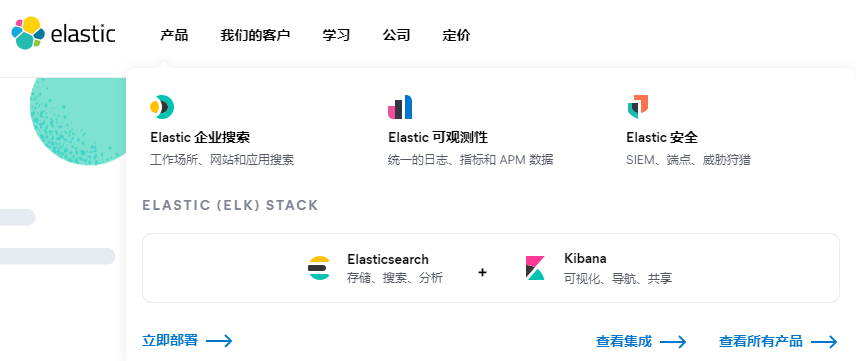


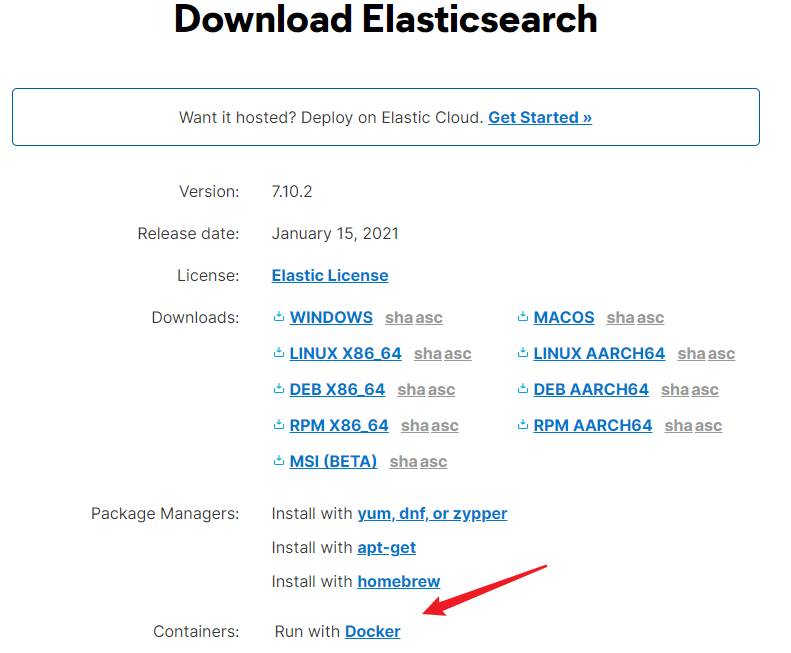

elasticSearch Head：一个前端项目


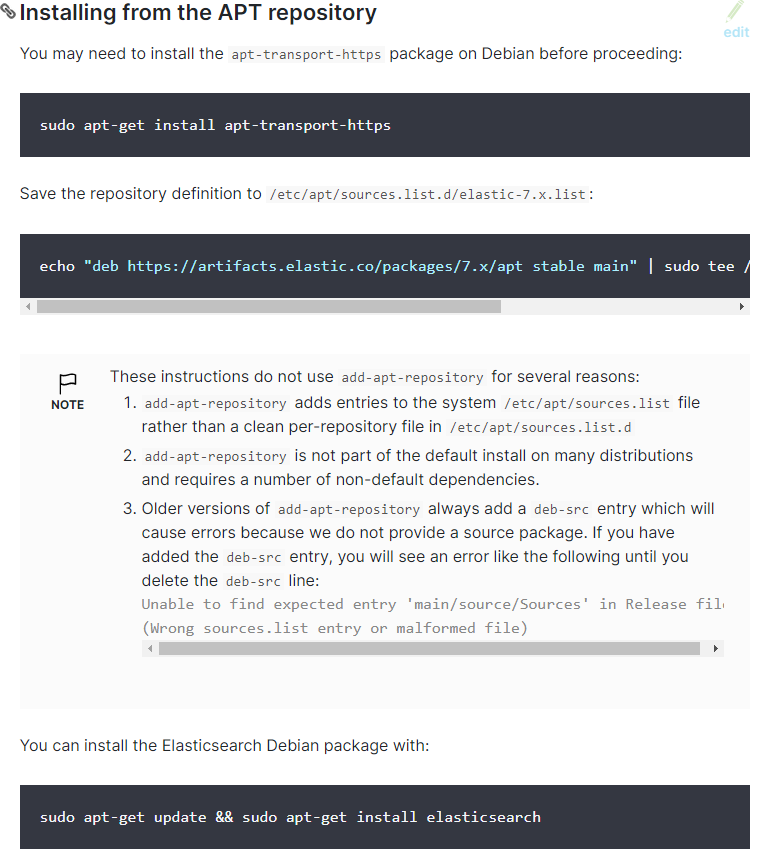

## 常见目录

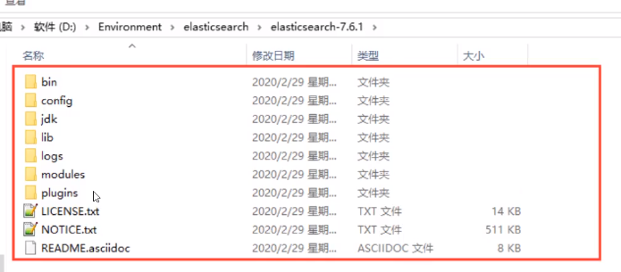

* bin:二进制
* config:配置文件
  - log4j2:日志配置
  - jvm.options:Java虚拟机配置
  - elasticsearch.yml:elasticsearch的配置文件，默认端口9200
* jdk:Java虚拟机
* lib:依赖Jar包
* modules:功能模块
* plugins:插件目录
* logs:输出日志


修改默认虚拟机内存分配

```
drwxr-xr-x  2 elasticsearch elasticsearch   4096 Feb  4 14:59 bin
drwxr-xr-x  3 elasticsearch elasticsearch   4096 Feb  4 15:22 config
drwxrwxr-x  3 elasticsearch elasticsearch   4096 Feb  4 15:00 data
drwxr-xr-x  9 elasticsearch elasticsearch   4096 Jan 13 08:46 jdk
drwxr-xr-x  3 elasticsearch elasticsearch   4096 Jan 13 08:46 lib
-rw-r--r--  1 elasticsearch elasticsearch  13675 Jan 13 08:39 LICENSE.txt
drwxrwxr-x  2 elasticsearch elasticsearch   4096 Feb  4 18:12 logs
drwxr-xr-x 53 elasticsearch elasticsearch   4096 Jan 13 08:47 modules
-rw-r--r--  1 elasticsearch elasticsearch 544318 Jan 13 08:44 NOTICE.txt
drwxr-xr-x  2 elasticsearch elasticsearch   4096 Jan 13 08:44 plugins
-rw-r--r--  1 elasticsearch elasticsearch   7313 Jan 13 08:39 README.asciidoc
```

## 启动

默认是```127.0.0.1:9200```

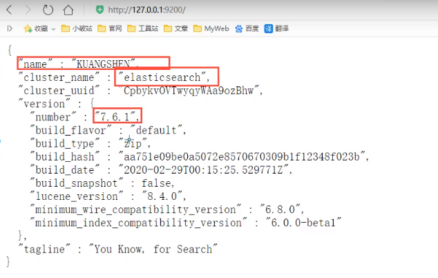

```You Know,for Search```


怎么使用？

## 安装可视化界面head

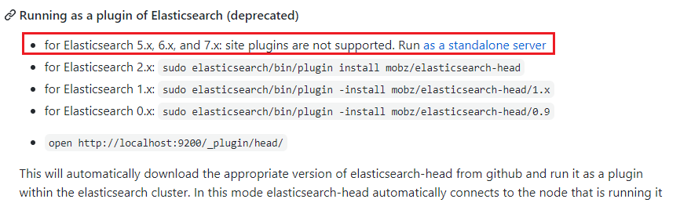

* 必须安装nodejs

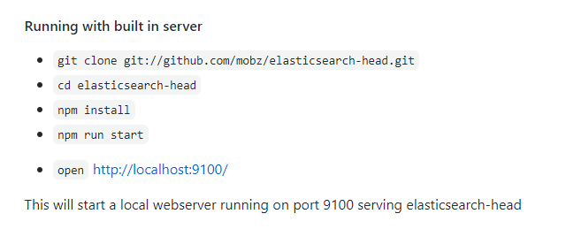

修改head访问端口

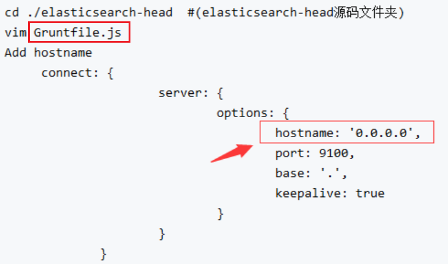

修改如下：

```
connect: {
			server: {
				options: {
					hostname: '9.134.180.32',
					port: 9100,
					base: '.',
					keepalive: true
				}
			}
		}

```

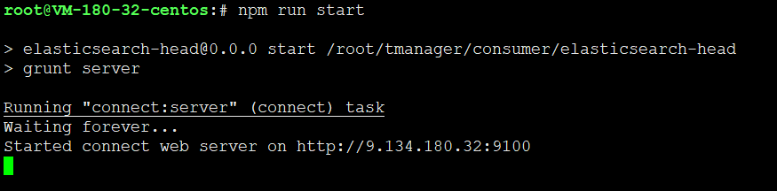

## 跨域问题解决

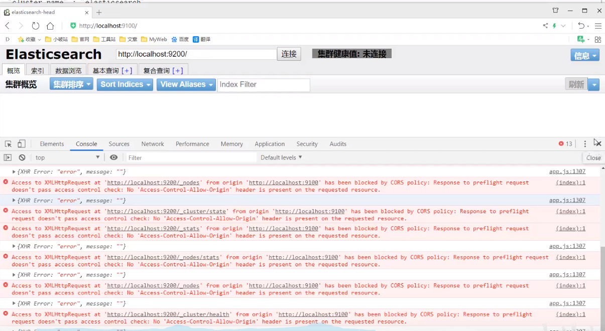


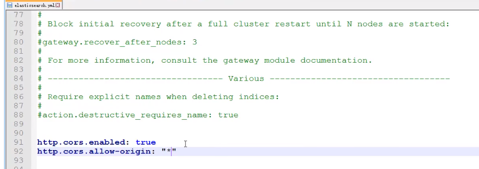

```
http.cors.enabled: true
http.cors.allow-origin: "*"
```

重启ES服务再次连接


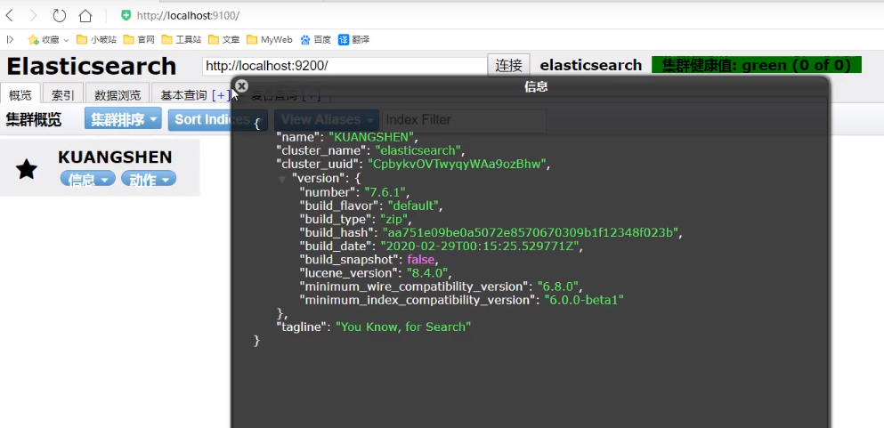

## 索引


创建索引，就当做创建数据库

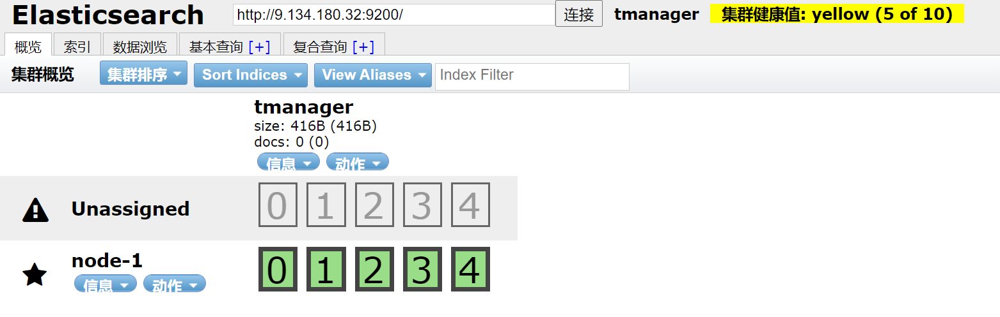

```
npm install --force

npm run start
```

* head只是插件，当做简单数据展示工具。
* 查询还是要用kabanna


---
